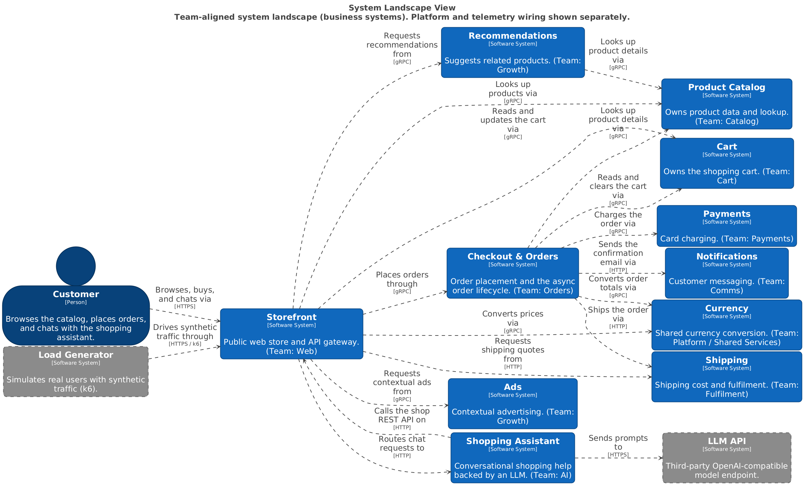
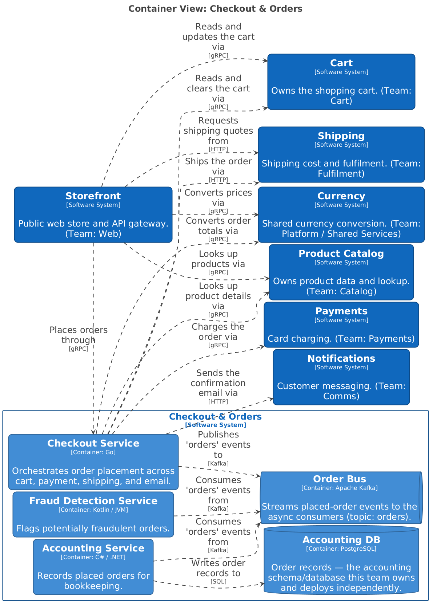
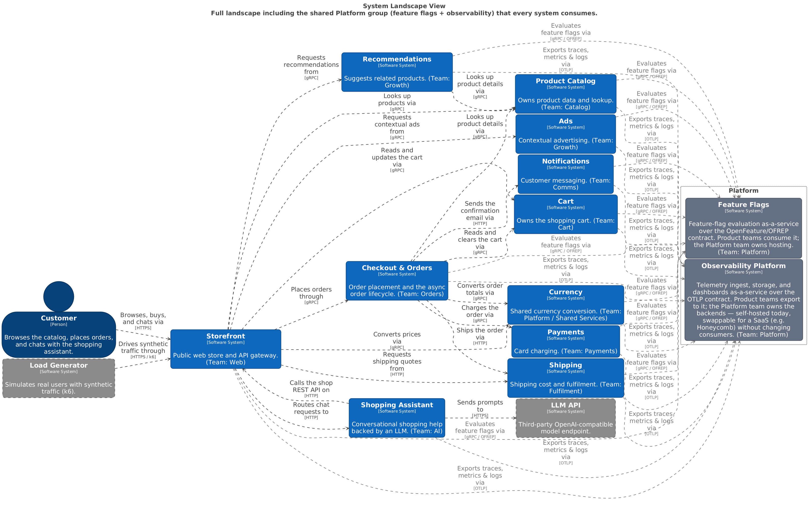
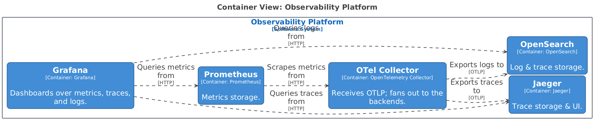
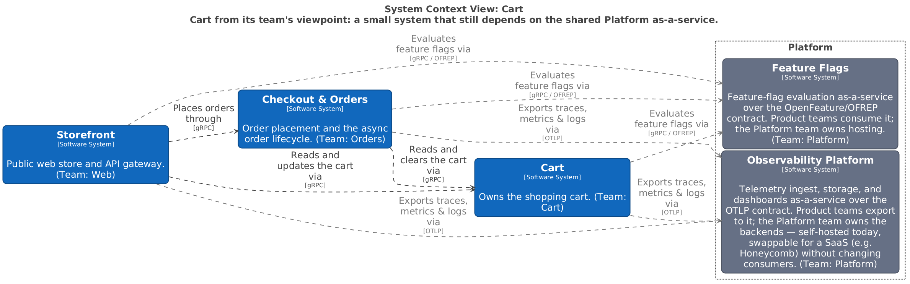
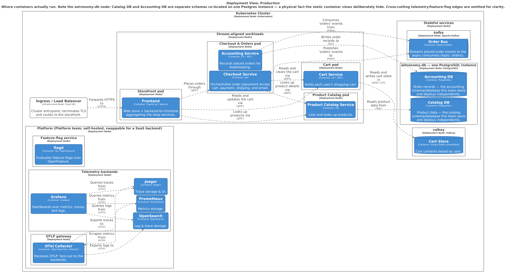

# Astronomy Shop — C4 Architecture (system landscape)

The **canonical** C4 model for the Astronomy Shop, modelled as a **system landscape**: each
domain is its own **software system** owned by a **team**, so container views are team-sized
instead of a 22-container wall. Source of truth: [`workspace.dsl`](workspace.dsl); images in
[`exports/`](exports/) are generated from it (see [Regenerating](#regenerating)).

> An earlier single-system model (one "Astronomy Shop" system containing all ~22 containers) is
> kept for comparison under [`single-system/`](single-system/). Its container view is the wall of
> boxes that motivated this decomposition.

## Why a landscape

A single system with ~22 containers doesn't map to one team, and its container diagram is
unreadable. When a system outgrows one team, C4 says model it as a **landscape of several
systems** (each a bounded context / team boundary), and that's what this does.



Eleven business systems, each labelled with a plausible owning team; the container view of each
is now 1–5 containers. The shared **Platform** is deliberately excluded here (see below).

## Modeling decisions

**Kafka is internal to Checkout & Orders, not a shared platform.** There's one topic (`orders`);
`checkout` produces, `accounting` and `fraud-detection` consume on **independent consumer groups**
(pub/sub fan-out — each gets every event). Producer and both consumers all live in the Orders
bounded context, so the Order Bus is a container *inside* that system. No other system touches it.



**Two databases, not one shared DB.** Product Catalog and Accounting connect to the same physical
Postgres but to **separate schemas** (`catalog` vs `accounting`) they each own and could isolate by
login, deploy independently, or move to different clusters/engines. By the tests that matter —
ownership, isolation, independent lifecycle — they're **separate database containers**, one per
system. The single `init.sql` / shared instance is a *deployment* fact, shown on the deployment
view below, not the static container view.

**Platform capabilities (flagd, OTel collector) are shared systems in a `group "Platform"`.**
Consumed by every system — but the fan-in is kept **off the clean landscape** (a view problem, not
a model problem) and shown in its own view. They're styled **solid slate** — one of three ownership
classes (see next section):



Each platform capability is itself a system with its own container view — e.g. the observability
pipeline (Collector receives OTLP → fans out to Jaeger/OpenSearch; Prometheus scrapes; Grafana
queries):



## "External" is scope-relative

The key nuance from this exercise: **whether the Platform is "external" depends on the diagram's
scope.**

- On the **org-wide System Landscape**, the Platform is **internal** — the org owns it, the Platform
  team builds it.
- On a **product team's System Context**, the Platform is **external** — outside that team's boundary
  and control. The team codes to a stable contract (OTLP, OFREP); whether Grafana is self-hosted or
  swapped for Honeycomb SaaS is invisible to them. This is the Team-Topologies "platform-as-a-service
  consumed by stream-aligned teams."

The same element is internal on one diagram and external on another — because "your boundary"
changes with scope. The per-team context views show it:



> Structurizr styling is **global by tag**, so an element can't be one colour on the landscape and
> another on team views. We use **three ownership classes**: **blue** = our product systems;
> **solid slate** = internal but another team's (the Platform); **grey with a dashed border** =
> outside the org entirely (the LLM API, the load generator). The `group "Platform"` boundary keeps
> the platform identifiable as the org's own on the landscape.

## Deployment — the physical topology

The home for the facts the static views abstract away. Note the `astronomy-db` node: **Catalog DB
and Accounting DB are separate schemas co-located on one Postgres instance** — logically two
databases, physically one. This view also carries the infrastructure the static views omit: the
cluster **Ingress / Load Balancer** (an `infrastructureNode`) and the collector's **OTLP gateway**
topology (one central collector; a per-pod sidecar or per-node agent are the alternatives), plus
the Platform's self-hosted-vs-SaaS choice.



## Views in this model

| View | Kind | Purpose |
|---|---|---|
| `Landscape` | System Landscape | Clean team-aligned map; Platform excluded |
| `PlatformLandscape` | System Landscape | Full picture incl. the shared Platform fan-in |
| `OrdersContext`, `CartContext` | System Context | A product team's viewpoint; Platform as external dependency |
| `Storefront`, `ShoppingAssistant`, `CheckoutOrders`, `ProductCatalog`, `Cart`, `Shipping` | Container | Each system's internals — team-sized |
| `ObservabilityPlatform`, `FeatureFlags` | Container | How the platform capabilities are built |
| `Deployment` | Deployment | Physical topology; DB co-location; platform hosting |

## Regenerating

All tooling runs in Docker. **Browse/edit interactively** (local Structurizr server at
<http://localhost:8080>):

```bash
docker run --rm -p 8080:8080 \
  -v "$(pwd)/docs/architecture:/usr/local/structurizr" \
  structurizr/structurizr local
```

**Re-export images** after editing `workspace.dsl`:

```bash
cd docs/architecture
docker run --rm -v "$PWD:/work" -w /work structurizr/structurizr \
  export -workspace workspace.dsl -format plantuml -output exports
cd exports
docker run --rm -v "$PWD:/data" -w /data plantuml/plantuml -tpng "structurizr-*.puml"
docker run --rm -v "$PWD:/data" -w /data plantuml/plantuml -tsvg "structurizr-*.puml"
```

`exports/` also holds `.mmd` (Mermaid) and `.puml` (PlantUML) sources plus a `*-key.*` legend per
view. The same commands work in [`single-system/`](single-system/).
