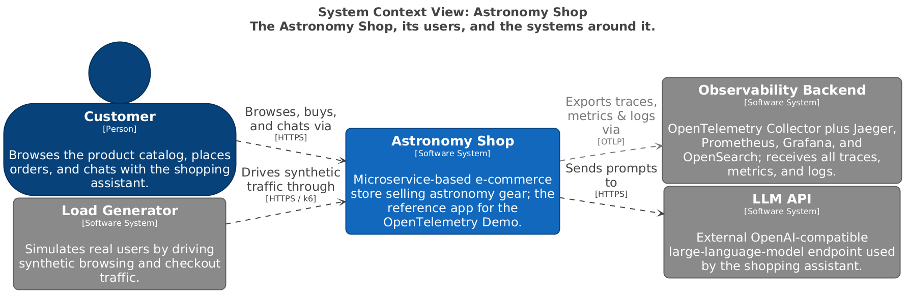
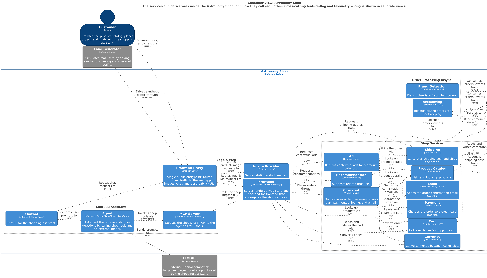
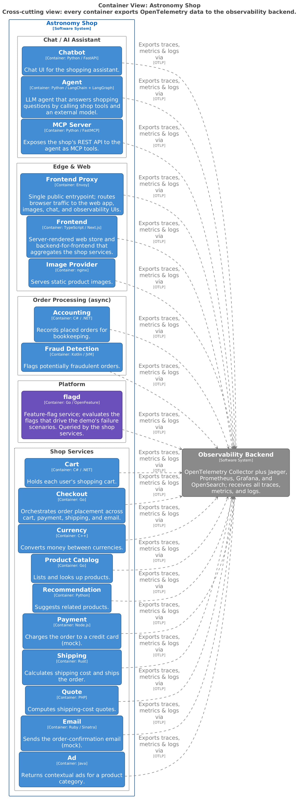
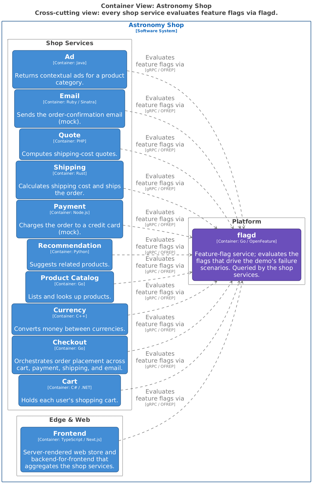

# Astronomy Shop — C4 Architecture (single-system model)

> **This is the earlier, single-system model, kept for comparison.** The canonical model is the
> team-aligned **system landscape** one directory up: [`../`](../). This version treats the whole
> shop as one software system; its ~22-container view is the wall of boxes that motivated the
> landscape decomposition.

C4-model diagrams for the OpenTelemetry Demo ("Astronomy Shop"), a microservice-based
e-commerce app instrumented end-to-end with OpenTelemetry.

The single source of truth is [`workspace.dsl`](workspace.dsl) (Structurizr DSL) — one
model, many views. Everything under [`exports/`](exports/) is generated from it; do not
hand-edit the images. See [Regenerating](#regenerating) below.

**Scope of these diagrams**

- **Audience:** new contributors building a mental model of the shop before touching a service.
- **System in scope:** the Astronomy Shop application. The **observability plane** (OpenTelemetry
  Collector, Jaeger, Prometheus, Grafana, OpenSearch) is modelled as a single **external**
  "Observability Backend" that every container exports to — matching how the app treats it.
- **Levels drawn:** System Context and Container (plus two cross-cutting container views).

---

## 1. System Context

The shop, the people/tools that drive it, and the systems it depends on.



- **Customer** browses, buys, and chats via the web UI.
- **Load Generator** (k6) drives synthetic traffic — the demo's stand-in for real users.
- **Observability Backend** receives all traces, metrics, and logs over OTLP.
- **LLM API** is the only genuinely external runtime dependency, used by the shopping assistant.

## 2. Containers

The services and data stores inside the shop and how they call each other. Feature-flag and
telemetry wiring is *deliberately excluded here* and shown in the two cross-cutting views below,
so the business call graph stays legible.



Highlights of the call graph:

- **Frontend** (BFF) fans out over **gRPC** to ad, cart, checkout, currency, product-catalog,
  and recommendation, and over **HTTP** to shipping.
- **Checkout** orchestrates an order across cart, currency, product-catalog, payment (gRPC),
  shipping and email (HTTP), then **publishes an `orders` event to Kafka**.
- **Accounting** and **Fraud Detection** consume that `orders` event asynchronously from Kafka.
- **Cart** persists to **Valkey**; **Product Catalog** and **Accounting** use **PostgreSQL**.
- The **Chat / AI** path: chatbot → agent → (MCP server → shop API) and → external LLM API.

## 3. Cross-cutting: Telemetry

Every container exports OpenTelemetry data (traces, metrics, logs) to the collector. This
fan-in is the whole point of the demo, so it gets its own view instead of cluttering view 2.



## 4. Cross-cutting: Feature Flags

Every shop service evaluates feature flags via **flagd** (OpenFeature). These flags drive the
demo's injectable failure scenarios.



---

## Regenerating

All tooling runs in Docker; nothing is installed on the host.

**Render / edit interactively** (Structurizr Lite at <http://localhost:8080>):

```bash
docker run --rm -p 8080:8080 \
  -v "$(pwd)/docs/architecture:/usr/local/structurizr" \
  structurizr/structurizr local
```

**Re-export the images** after editing `workspace.dsl`:

```bash
cd docs/architecture
# Mermaid + PlantUML from the DSL
docker run --rm -v "$PWD:/work" -w /work structurizr/structurizr \
  export -workspace workspace.dsl -format mermaid  -output exports
docker run --rm -v "$PWD:/work" -w /work structurizr/structurizr \
  export -workspace workspace.dsl -format plantuml -output exports
# Rasterise PlantUML -> PNG + SVG
cd exports
docker run --rm -v "$PWD:/data" -w /data plantuml/plantuml -tpng "structurizr-*.puml"
docker run --rm -v "$PWD:/data" -w /data plantuml/plantuml -tsvg "structurizr-*.puml"
```

`exports/` also contains `.mmd` (Mermaid) and `.puml` (PlantUML) sources, plus a `*-key.*`
legend for each view.
